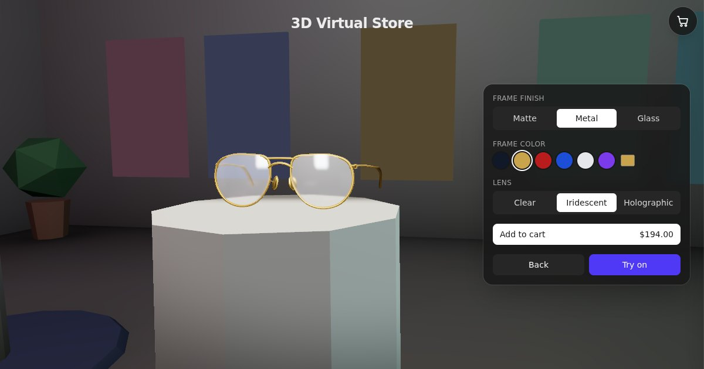

# 3D Virtual Store & Try-On

A portfolio proof of concept: walk through a small 3D showroom, pick a product off a pedestal, customize it, try it
on with your webcam and take a photo. It runs entirely in the browser, with WebGPU (plus an automatic WebGL 2
fallback) for rendering and MediaPipe for face tracking.

**Live demo:** _coming soon — `https://<your-deployment>.vercel.app`_



## Features

- **Explore.** A low-poly showroom with baked lighting and one pedestal per product (three glasses, one lipstick).
  - Walk with WASD, ZQSD or the arrow keys (physical key positions, Shift to run), or with the mouse wheel.
  - Drag to look around. Click or tap the floor to walk there.
  - Near a pedestal, a "Press E / Click" prompt (or "Tap to view" on touch screens) opens the product.
- **Customize.**
  - Glasses: frame finish (matte, metal or transmissive glass), frame color (presets plus any custom color),
    and lens (clear, iridescent, or a holographic TSL shader).
  - Lipstick: finish (matte, satin, gloss, metallic) and shade (presets plus any custom color).
  - The price updates live. The whole panel is generated from the product's schema.
- **Try on.**
  - Real-time face tracking from the webcam. Glasses are anchored to the head pose; a depth-only head occluder
    hides the temples behind the head.
  - Lipstick is painted on a face mesh updated from the 468 landmarks on every detection. The lips are masked from
    MediaPipe's official lip contours, so the mouth interior stays visible when it opens.
  - Selfie mirroring and pose smoothing.
  - A demo video can be used when no camera is available or access is denied.
- **Photo booth.** Captures the video frame and the 3D render together, exactly as shown on screen, and downloads
  the result as a PNG.
- **Cart.**
  - A drawer with a 256 px rendered thumbnail of each configured item, per-option price lines and a total.
  - "Try on" from any cart item.
  - Instanced particles fly to the cart icon when an item is added.
- **Hardening.**
  - Every try-on failure has an explanation and a way out: camera blocked, missing, busy or unplugged, insecure
    origin, stalled stream, model failure, face lost.
  - A clear message when neither WebGPU nor WebGL 2 is available, and when the GPU device is lost.
  - A warning when the frame rate stays low.
  - A loading screen driven by the actual asset progress.
- **Mobile & accessibility.**
  - Portrait phone layout, touch gestures.
  - Full keyboard navigation with a visible focus ring.
  - Focus-trapped dialogs that close with Escape.
  - ARIA labels on icon buttons.
  - `prefers-reduced-motion` support: fast camera transitions, no particle burst, no CSS animations.

## Architecture

```
app/layout.tsx          Root layout: the persistent <SceneCanvas/> + DOM overlays, metadata, asset preloads
components/canvas/      Everything inside the single R3F <Canvas> (client-only, loaded with next/dynamic ssr:false)
  Scene.tsx               WebGPURenderer factory, product renderers from the registry, Suspense boundaries
  Showroom / Player / CameraRig / InteractPrompt   EXPLORE (walking, collisions, proximity prompt, camera)
  Glasses.tsx             Product renderer: materials per option, store/CUSTOMIZE/try-on placement
  FaceAnchor / HeadOccluder                         TRY_ON: pose-driven group + depth-only occluder
  PostFx.tsx              TSL post-processing (CUSTOMIZE background dim + vignette), owns the render loop
  ThumbnailRenderer / CartParticles                 Cart thumbnails (offscreen render target) and feedback
components/dom/         HTML overlays: customizer, try-on panel, photo modal, cart drawer, status/loading screens
hooks/useTryOnSession   Camera or demo video → FaceLandmarker → smoothed pose, errors, watchdogs
store/                  zustand store in slices: world (mode + transitions), product, tryOn, cart
lib/products/           Product registry + schema helpers (validation, defaults, price deltas)
lib/tryon/              MediaPipe loading, One Euro smoothing, capture, error classification, constants
lib/explore/            Showroom layout (shared with the model generator), movement and collisions
scripts/                Model generators (glTF-Transform + Draco) and the postinstall asset copier
```

**Modes.** `EXPLORE → CUSTOMIZE → TRY_ON → PHOTO`. Moves happen only through an explicit transition table
(`lib/modes.ts`, unit-tested); invalid events are ignored. The cart is an orthogonal drawer (`cartOpen`), not a
mode. Modes change what the one persistent `<Canvas>` draws; the Canvas is never remounted.

**Products are data** (`lib/products`). Each entry defines:
- id, name, category and base price;
- an attachment type: `rigid` (driven by the facial transformation matrix), `surface` (on the deforming face
  mesh) or `landmark` (pinned to landmarks);
- a customization schema: `choice` options with price deltas, and `color` options with presets and optional custom
  colors;
- try-on calibration;
- the scene renderer that draws it.

The customizer UI, config validation and cart pricing are all derived from the schema. Products are placed on the
pedestal slots of `lib/explore/showroom-layout.json` in registry order.

## Key technical choices (and why)

| Choice | Why |
| --- | --- |
| `WebGPURenderer` (`three/webgpu`) only | One code path. It falls back to its own WebGL 2 backend when WebGPU is unavailable, so there is no separate fallback renderer to maintain. |
| TSL for materials and post-processing | TSL node graphs compile to both WGSL and GLSL. GLSL `ShaderMaterial` and `@react-three/postprocessing` are WebGL-only. The holographic lens and the CUSTOMIZE depth-based dim are small TSL graphs (`lib/materials.ts`, `PostFx.tsx`). |
| One persistent `<Canvas>` | Switching modes never recreates the GPU context or recompiles shaders, and the webcam stage reuses the same renderer. |
| One pre-built material per option | Swapping `mesh.material` avoids shader rebuilds, which toggling transmission or iridescence on one material would trigger. Every variant is kept drawn at a tiny scale: this pre-compiles them and works around a three r186 transmission bug where a material left undrawn keeps a stale screen-copy binding after a resize. |
| MediaPipe facial transformation matrix + matched camera | The 3D camera copies MediaPipe's face-geometry camera (origin, −Z, 63° vertical FOV) and the stage takes the video's aspect ratio. The pose matrix then places the model directly, with no PnP solving and no per-device FOV guessing. |
| `requestVideoFrameCallback` detection loop | Detection runs once per new video frame, not per render frame. It drops to 15 Hz / 10 Hz when rendering falls below 30 / 20 fps, and never runs more often than twice its own cost. |
| One Euro filter on the pose | Low jitter when the head is still and little lag when it moves, a better trade-off than a fixed low-pass filter. Tuned separately for position, rotation (quaternion) and scale. |
| Mirroring with one CSS `scaleX(-1)` | Video and 3D flip together, so there is no mirrored math in the tracking code. The photo capture applies the same flip. |
| Capture renders and reads in the same task | The WebGL drawing buffer is not preserved, and a WebGPU canvas texture is only valid until it is presented, so a read in a later task would be blank. |
| Baked vertex-color lighting in the showroom | The showroom has no runtime lights or shadow maps: it is unlit geometry, cheap on phones, and its lighting is generated from the same layout JSON as the collisions. |
| No physics engine | Circle push-out against pedestals and room bounds (`lib/explore/movement.ts`) covers walking. Rapier would add weight for nothing here. |
| Draco meshes, local decoder | 113 KB gzipped including the decoder, versus 224 KB uncompressed. There are no image textures, so KTX2 does not apply. |
| Lazy MediaPipe | The MediaPipe JS, WASM and model load only when entering try-on, with a percentage. They are also prefetched while idle in CUSTOMIZE, except with Data Saver or on 2G/3G connections. |
| Static export (`output: 'export'`) | There is no server: the app is static files on Vercel's free tier. `vercel.json` pins the build to `out/`. |
| zustand slices | Small store, no providers. The render loop reads state with `getState()` and components subscribe to narrow selectors, so per-frame work does not re-render the DOM UI. |

## Privacy

Everything runs locally in your browser:

- **Camera frames** go straight from `getUserMedia` into MediaPipe's WebAssembly build, running in the page. No
  frame, landmark or photo is uploaded anywhere. The camera is stopped as soon as you leave try-on.
- **Photos** are encoded to PNG in the page and saved with a normal download link.
- **Nothing is sent to external servers.** The app has no analytics, and all assets (models, Draco decoder,
  MediaPipe WASM and model, demo video) are served from the same origin. MediaPipe's built-in usage logging would
  normally `fetch()` a Google endpoint; `lib/networkGuard.ts` answers any cross-origin `fetch` or `sendBeacon` locally
  instead, so it never leaves the device. In automated runs of the full loop, no request left the site's origin.
- **Storage:** the only thing stored is a `sessionStorage` flag recording that you dismissed the low-frame-rate
  warning. The cart lives in memory only.

## Known limitations

- **Placeholder products.** The three glasses share a procedural model and differ only by default configuration
  and price. The lipstick is a procedural tube. `rigid` (glasses) and `surface` (lipstick) are implemented;
  `landmark` exists in the registry types only.
- **Lipstick shading is an estimate.** The shade is lit using the video's own luminance, so very dark or blown-out
  lighting shifts how the color reads, and the lip outline follows the tracked landmarks, not the real lip edge.
- **Fit is approximate.** Calibration is a per-product offset and scale on a fixed anchor, so glasses can sit a
  little high or low on some faces. With `?debug`, calibration sliders appear in try-on.
- **Tracking lag on slow devices.** When detection runs slowly, the pose trails fast head movements. A photo
  taken mid-movement pairs the current video frame with the last detected pose, so it can show that offset.
- **One face** is tracked (`numFaces: 1`). The view is always mirrored.
- **First try-on download** is about 16 MB uncompressed (about 6.8 MB gzipped): the MediaPipe WASM plus the
  float16 model. It is cached by the browser afterwards.
- **No checkout, no persistence.** The cart is a demo and is lost on reload.
- **Testing coverage.** Automated browser tests ran on the WebGL 2 backend (headless Chromium with SwiftShader, no
  GPU), where frame rates are far below real hardware. The WebGPU path is exercised only on real hardware.
- **Browser-level console messages.** In production the app itself logs nothing. On machines without WebGPU,
  Chromium itself may still print "WebGPU is experimental on this platform" or driver messages, which the page
  cannot suppress.

## Run locally

Requirements: Node.js 22 and npm.

```bash
npm install          # postinstall copies the Draco decoder and MediaPipe WASM into public/
npm run dev          # http://localhost:3000 (debug tools on)
npm run build        # static export to ./out
npm start            # serve ./out
npm test             # vitest unit tests
npm run lint
```

- The camera needs a secure context: `localhost` works, and other hosts need HTTPS.
- To regenerate the procedural models (glasses, head occluder, showroom with baked lighting) and the face mesh
  topology after editing a generator or `lib/explore/showroom-layout.json`, run `npm run generate:models`.

**Debug tools.** They are always on in `next dev`. In production, add `?debug` to the URL to get:
- a mode-transition panel with fps, GPU time and program count;
- a renderer backend badge;
- try-on calibration sliders;
- console logging.

### Runtime assets

| Path | Source | How it gets there |
| --- | --- | --- |
| `public/draco/` | `three/examples/jsm/libs/draco/gltf` | `postinstall` (gitignored) |
| `public/mediapipe/wasm/`, `manifest.json` | `@mediapipe/tasks-vision/wasm` (+ byte sizes for progress) | `postinstall` (gitignored) |
| `public/mediapipe/face_landmarker.task` | Google MediaPipe Face Landmarker model (float16) | manual download (committed) |
| `public/models/glasses.glb` | procedural placeholder | `npm run generate:models` (committed) |
| `public/models/showroom.glb` | low-poly showroom, lighting baked into vertex colors | `npm run generate:models` (committed) |
| `public/models/head-occluder.glb` | MediaPipe canonical face + back-of-head ellipsoid | `npm run generate:models` (committed) |
| `public/demo/try-on-demo.{mp4,webm}` | demo clip (see `docs/demo-video.md`) | committed |

Paths are exported from `lib/assets.ts`. To re-download the face model:

```bash
curl -L -o public/mediapipe/face_landmarker.task \
  https://storage.googleapis.com/mediapipe-models/face_landmarker/face_landmarker/float16/latest/face_landmarker.task
```

### Using a real glasses model

Replace `public/models/glasses.glb` (Draco is optional).
- Keep `lens` in the lens mesh or material name; every other mesh is treated as frame.
- Units are meters, with the origin at the bridge, the lenses in the z = 0 plane and the temples along −z.

## License

MIT — see `LICENSE`. `scripts/data/canonical_face_model.obj` is from MediaPipe (Apache License 2.0).
