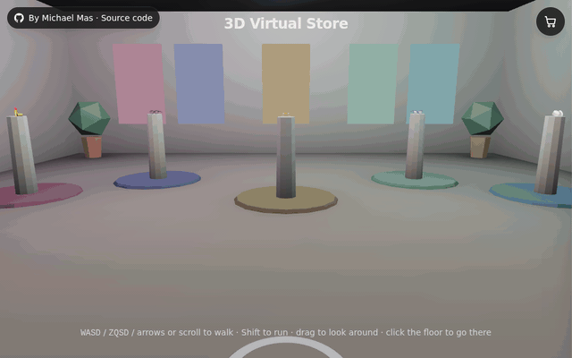

# 3D Virtual Store & Try-On

[](https://github.com/michael-mas/3d-virtual-store/actions/workflows/ci.yml)

A portfolio proof of concept: walk through a small 3D showroom, pick a product off a pedestal, customize it, try it
on with your webcam and take a photo. It runs entirely in the browser, with WebGPU (plus an automatic WebGL 2
fallback) for rendering and MediaPipe for face tracking.

**Live demo: [3d-virtual-store-two.vercel.app](https://3d-virtual-store-two.vercel.app)** (desktop Chrome or Edge for WebGPU; any WebGL 2 browser works, including phones)



## Features

- **Explore.** A low-poly showroom with baked lighting and one pedestal per product (three glasses, a lipstick, a face paint, a watch, a ring, a hair color, headwear).
  - Walk with WASD, ZQSD or the arrow keys (physical key positions, Shift to run), or with the mouse wheel.
  - Drag to look around. Click or tap the floor to walk there.
  - Near a pedestal, a "Press E / Click" prompt (or "Tap to view" on touch screens) opens the product.
- **Customize.**
  - Glasses: three procedurally generated frames (a metal aviator with double bridge and nose pads, a square
    acetate frame, a cat-eye) with curved lenses and a wrapped front. Frame finish (matte, metal or transmissive glass), frame color (presets plus any custom color),
    and lens (clear, iridescent, or a holographic TSL shader).
  - Lipstick: finish (matte, satin, gloss, metallic) and shade (presets plus any custom color).
  - Face paint: design (tiger stripes, masquerade, constellation), style (paint, neon, holographic), color and an
    opacity slider.
  - Watch: case (steel, gold, black), dial color and strap (leather, metal bracelet, rubber); its hands show the
    current time.
  - Ring: metal, stone (diamond, ruby, emerald, sapphire or none) and the finger it is worn on.
  - Hair color: color (presets plus any custom color), finish (natural, vivid, pastel) and intensity.
  - Headwear: style (cap, beanie, bucket hat), color and accent color, shown on a hat block.
  - The price updates live. The whole panel is generated from the product's schema.
- **Try on.**
  - Real-time face tracking from the webcam. Glasses are anchored to the head pose; a depth-only head occluder
    hides the temples behind the head.
  - Lipstick is painted on a face mesh updated from the 468 landmarks on every detection. The lips are masked from
    MediaPipe's official lip contours, so the mouth interior stays visible when it opens.
  - Face paint designs are drawn in canonical-UV space on the same mesh, so they deform with expressions; the
    eyes and lips are always left bare. Neon and holographic glow brighten as the mouth opens (FaceLandmarker's
    `jawOpen` blendshape).
  - Watches and rings follow the hand (MediaPipe HandLandmarker, loaded only when a hand product is worn): the
    watch sits on the wrist with its dial on the back of the wrist, the ring on the base of the chosen finger, and
    depth-only wrist and finger occluders hide what passes behind them.
  - Headwear follows the head pose like glasses, cut along a tilted line on a skull fitted to MediaPipe's
    canonical face so it clears the forehead.
  - Hair color recolors the hair MediaPipe's hair segmenter finds in the frame, keeping its strands and shading;
    "vivid" lifts dark hair as if bleached first.
  - Selfie mirroring and pose smoothing.
  - Optional demo mode: a looping face clip through the same pipeline, for visitors without a webcam (no clip is
    bundled, see `docs/demo-video.md`).
- **Photo booth.** Captures the video frame and the 3D render together, exactly as shown on screen, and downloads
  the result as a PNG.
- **Cart.**
  - A drawer with a 256 px rendered thumbnail of each configured item, per-option price lines and a total.
  - "Try on" from any cart item, or **the whole look**: every zone at once (hair color, face paint, lipstick, hat,
    glasses, watch, ring), one item
    per zone, with a switcher in try-on to swap items within a zone or leave it bare. Zones come from the registry
    (`TRY_ON_ZONES`), so a new zone (hats, lenses…) needs no UI change.
  - Instanced particles fly to the cart icon when an item is added.
- **Hardening.**
  - Every try-on failure has an explanation and a way out: camera blocked, missing, busy or unplugged, insecure
    origin, stalled stream, model failure, face lost.
  - A clear message when neither WebGPU nor WebGL 2 is available, and when the GPU device is lost.
  - A warning when the frame rate stays low.
  - A loading screen driven by the actual asset progress.
- **Mobile & accessibility.**
  - Portrait phone layout, touch gestures.
  - Full keyboard navigation with a visible focus ring.
  - Focus-trapped dialogs that close with Escape.
  - ARIA labels on icon buttons.
  - `prefers-reduced-motion` support: fast camera transitions, no particle burst, no CSS animations.

## Architecture

```
app/layout.tsx          Root layout: the persistent <SceneCanvas/> + DOM overlays, metadata, asset preloads
components/canvas/      Everything inside the single R3F <Canvas> (client-only, loaded with next/dynamic ssr:false)
  Scene.tsx               WebGPURenderer factory, product renderers from the registry, Suspense boundaries
  Showroom / Player / CameraRig / InteractPrompt   EXPLORE (walking, collisions, proximity prompt, camera)
  Glasses.tsx             Rigid product renderer: materials per option, store/CUSTOMIZE/try-on placement
  Lipstick / FacePaint    Surface product renderers: packaging on the pedestal, mannequin in CUSTOMIZE
  Watch / Ring / HandAnchor                         Landmark products: on display, then pinned to the tracked hand
  HairDye                 Segmentation product: dye bottle on display, drives the hair recolor in try-on
  Headwear                Rigid product: cap / beanie / bucket hat on a hat block, worn on the head pose
  MannequinPreview        Mannequin head wearing a surface product (CUSTOMIZE preview, cart thumbnail)
  FaceAnchor / HeadOccluder                         TRY_ON rigid layer: pose-driven group + depth-only occluder
  SurfaceLayer            TRY_ON surface layer: live face mesh, orthographic camera, render target
  PostFx.tsx              TSL post-processing (CUSTOMIZE background dim + vignette), owns the render loop
  ThumbnailRenderer / CartParticles                 Cart thumbnails (offscreen render target) and feedback
components/dom/         HTML overlays: customizer, try-on panel, photo modal, cart drawer, status/loading screens
hooks/useTryOnSession   Camera (or demo clip) → the trackers the worn products need (Face/HandLandmarker,
                        hair segmenter) →
                        smoothed poses, errors, watchdogs
store/                  zustand store in slices: world (mode + transitions), product, tryOn, cart
lib/products/           Product registry + schema helpers (validation, defaults, price deltas)
lib/tryon/              MediaPipe loading, One Euro smoothing, capture, error classification, constants,
                        face mesh topology (from MediaPipe's official metadata), hand pose and the video layer
lib/tryon/surface/      Surface products: UV masks, lipstick and face paint TSL materials, mannequin geometry
lib/explore/            Showroom layout (shared with the model generator), movement and collisions
scripts/                Model generators (glTF-Transform + Draco) and the postinstall asset copier
```

**Modes.** `EXPLORE → CUSTOMIZE → TRY_ON → PHOTO`. Moves happen only through an explicit transition table
(`lib/modes.ts`, unit-tested); invalid events are ignored. The cart is an orthogonal drawer (`cartOpen`), not a
mode. Modes change what the one persistent `<Canvas>` draws; the Canvas is never remounted.

**Products are data** (`lib/products`). Each entry defines:
- id, name, category and base price;
- an attachment type: `rigid` (driven by the facial transformation matrix), `surface` (on the deforming face
  mesh), `landmark` (pinned to hand landmarks) or `segmentation` (a recolor of a segmented region of the video);
- a try-on zone (hair, skin, lips, head, eyewear, wrist, finger), which also picks the tracker (face, hand or hair);
- a customization schema: `choice` options with price deltas, `color` options with presets and optional custom
  colors, and `range` options (sliders, e.g. opacity);
- try-on calibration;
- the scene renderer that draws it.

The customizer UI, config validation and cart pricing are all derived from the schema. Products are placed on the
pedestal slots of `lib/explore/showroom-layout.json` in registry order.

## Attachment types

How a product follows the body in TRY_ON is set by its `attachment` in the registry:

| Type | Products | How it works |
| --- | --- | --- |
| `rigid` | Glasses, headwear | A 3D model in the main scene, driven by FaceLandmarker's facial transformation matrix (smoothed with One Euro filters) under a camera matching MediaPipe's (63° vertical FOV). A depth-only head occluder hides what is behind the head. | Hats are domes cut along a tilted line on a typical skull ellipsoid fitted to enclose the canonical forehead (`lib/headwear/geometry.ts`, unit-tested against the canonical mesh), so the face part of the occluder never hides their front.
| `surface` | Lipstick, face paint | A face mesh rebuilt in place from the 468 landmarks on every detection, with MediaPipe's canonical tessellation and UVs (`scripts/data/geometry_pipeline_metadata_landmarks.pbtxt`). It is drawn by an orthographic camera covering the video frame into a render target, which the scene background composites over the video and under the rigid layer, so glasses sit on top of makeup. Products are masks in canonical-UV space (lips from the official lip contours; face paint designs authored in centimeters on the canonical face) with TSL materials that reuse the video's luminance. |
| `landmark` | Watch, ring | Pinned to HandLandmarker's 21 hand landmarks (`lib/tryon/handPose.ts`). The hand's shape comes from the normalized image landmarks (with their relative depth), which stay consistent where the world landmarks can degenerate; a typical palm size gives the metric scale and therefore the distance, and each point is back-projected under the same camera as the face. The palm side comes from MediaPipe's handedness label, checked on MediaPipe's own test images (palm or back toward the camera, and a mirrored pair, kept as a test fixture). The watch is placed up the forearm from the wrist with its dial out of the back of the hand; the ring on the base segment of the chosen finger. Points are smoothed with One Euro filters, and depth-only wrist and finger occluders hide the back of the strap and band. |
| `segmentation` | Hair color | MediaPipe's hair segmenter (ImageSegmenter, 780 KB) gives a per-pixel hair confidence on each detection, resampled into a fixed 480×270 mask texture refilled in place. The scene background recolors the video through it before the surface layer: the dye's hue carried by the hair's own lightness (optionally lifted, for dark hair, and softened, for pastel), so strands and shading survive and the soft mask edges blend into the natural color. |

There is no webcam in CUSTOMIZE, so surface products are previewed on a neutral mannequin head built from the same
canonical mesh (same UVs, so the same masks), lit by the scene; cart thumbnails render that mannequin.

**Adding a product** = a registry entry in `lib/products` (id, name, category, attachment, try-on zone, schema,
calibration, renderer), a pedestal slot in `lib/explore/showroom-layout.json` (then `npm run generate:models`), and for a new
renderer its scene component (`RENDERERS` in `components/canvas/Scene.tsx`) and, for surface products, its try-on
and preview materials (`SURFACES` in `SurfaceLayer.tsx`, `PREVIEWS` in `MannequinPreview.tsx`). A product in a new
zone only needs the zone in `TRY_ON_ZONES`: the look switcher and the trackers follow.

## Key technical choices (and why)

| Choice | Why |
| --- | --- |
| `WebGPURenderer` (`three/webgpu`) only | One code path. It falls back to its own WebGL 2 backend when WebGPU is unavailable, so there is no separate fallback renderer to maintain. |
| TSL for materials and post-processing | TSL node graphs compile to both WGSL and GLSL. GLSL `ShaderMaterial` and `@react-three/postprocessing` are WebGL-only. The holographic lens and the CUSTOMIZE depth-based dim are small TSL graphs (`lib/materials.ts`, `PostFx.tsx`). |
| One persistent `<Canvas>` | Switching modes never recreates the GPU context or recompiles shaders, and the webcam stage reuses the same renderer. |
| One pre-built material per option | Swapping `mesh.material` avoids shader rebuilds, which toggling transmission or iridescence on one material would trigger. Every variant is kept drawn at a tiny scale: this pre-compiles them and works around a three r186 transmission bug where a material left undrawn keeps a stale screen-copy binding after a resize. |
| MediaPipe facial transformation matrix + matched camera | The 3D camera copies MediaPipe's face-geometry camera (origin, −Z, 63° vertical FOV) and the stage takes the video's aspect ratio. The pose matrix then places the model directly, with no PnP solving and no per-device FOV guessing. |
| `requestVideoFrameCallback` detection loop | Detection runs once per new video frame, not per render frame. It drops to 15 Hz / 10 Hz when rendering falls below 30 / 20 fps, and never runs more often than twice its own cost. |
| One Euro filter on the pose | Low jitter when the head is still and little lag when it moves, a better trade-off than a fixed low-pass filter. Tuned separately for position, rotation (quaternion) and scale. |
| Mirroring with one CSS `scaleX(-1)` | Video and 3D flip together, so there is no mirrored math in the tracking code. The photo capture applies the same flip. |
| Capture renders and reads in the same task | The WebGL drawing buffer is not preserved, and a WebGPU canvas texture is only valid until it is presented, so a read in a later task would be blank. |
| Baked vertex-color lighting in the showroom | The showroom has no runtime lights or shadow maps: it is unlit geometry, cheap on phones, and its lighting is generated from the same layout JSON as the collisions. |
| No physics engine | Circle push-out against pedestals and room bounds (`lib/explore/movement.ts`) covers walking. Rapier would add weight for nothing here. |
| Draco meshes, local decoder | 113 KB gzipped including the decoder, versus 224 KB uncompressed. There are no image textures, so KTX2 does not apply. |
| Lazy MediaPipe | The MediaPipe JS, WASM and model load only when entering try-on, with a percentage. They are also prefetched while idle in CUSTOMIZE, except with Data Saver or on 2G/3G connections. |
| Static export (`output: 'export'`) | There is no server: the app is static files on Vercel's free tier. `vercel.json` pins the build to `out/`. |
| zustand slices | Small store, no providers. The render loop reads state with `getState()` and components subscribe to narrow selectors, so per-frame work does not re-render the DOM UI. |

## Privacy

Everything runs locally in your browser:

- **Camera frames** go straight from `getUserMedia` into MediaPipe's WebAssembly build, running in the page. No
  frame, landmark or photo is uploaded anywhere. The camera is stopped as soon as you leave try-on.
- **Photos** are encoded to PNG in the page and saved with a normal download link.
- **Nothing is sent to external servers.** The app has no analytics, and all assets (models, Draco decoder,
  MediaPipe WASM and model) are served from the same origin. MediaPipe's built-in usage logging would
  normally `fetch()` a Google endpoint; `lib/networkGuard.ts` answers any cross-origin `fetch` or `sendBeacon` locally
  instead, so it never leaves the device. In automated runs of the full loop, no request left the site's origin.
- **Storage:** the only thing stored is a `sessionStorage` flag recording that you dismissed the low-frame-rate
  warning. The cart lives in memory only.

## Security and discoverability

- **Strict Content Security Policy.** A static export has no server to issue nonces, so `scripts/csp.mjs` runs
  after `next build` and adds a `<meta>` policy to every page. Next's inline bootstrap scripts are allowed by their
  SHA-256 hash, and everything else must come from the site itself. `'wasm-unsafe-eval'` allows compiling
  WebAssembly, but not JavaScript `eval`. The only `blob:` sources are Draco's worker, MediaPipe's WASM binary and
  captured photos. The end-to-end tests fail on any CSP violation.
- **HTTP headers** (`vercel.json`):
  - `frame-ancestors 'none'` and `X-Frame-Options`;
  - HSTS;
  - `nosniff`;
  - a strict referrer policy;
  - `Permissions-Policy`: the camera for this origin only, everything else off;
  - `Cross-Origin-Opener-Policy`.
- **Dependencies:** versions are pinned; `npm audit` reports 0 vulnerabilities.
- **Crawlers and AI assistants** cannot run WebGPU. The page therefore also carries:
  - a semantic text description of the app;
  - canonical, Open Graph and Twitter metadata;
  - schema.org `WebApplication` JSON-LD;
  - `robots.txt` and `sitemap.xml`;
  - [`llms.txt`](public/llms.txt).
- **Lighthouse:** 100 in accessibility, best practices and SEO. Source maps are published, since the code is open
  source.

## Known limitations

- **Procedural products.** Every model is generated by code, not authored in a 3D tool: three glasses styles
  (metal aviator, square acetate, cat-eye), a lipstick tube and a paint jar. `rigid` (glasses) and `surface`
  (lipstick, face paint) are implemented; `landmark` exists in the registry types only.
- **Lipstick shading is an estimate.** The shade is lit using the video's own luminance, so very dark or blown-out
  lighting shifts how the color reads, and the lip outline follows the tracked landmarks, not the real lip edge.
- **Fit is approximate.** Calibration is a per-product offset and scale on a fixed anchor, so glasses can sit a
  little high or low on some faces. With `?debug`, calibration sliders appear in try-on.
- **Tracking lag on slow devices.** When detection runs slowly, the pose trails fast head movements. A photo
  taken mid-movement pairs the current video frame with the last detected pose, so it can show that offset.
- **One face and one hand** are tracked (`numFaces: 1`, `numHands: 1`). The view is always mirrored.
- **Hair color only recolors the hair you have.** It cannot make hair shorter or longer, and the soft mask edges
  can tint a little of the background next to the hair.
- **Hand distance is estimated** from a typical adult palm size, so a much smaller or larger hand reads as farther
  or closer: the watch and ring stay on the hand but are scaled within bounds. The fingers do not hide the watch.
- **First try-on download** is about 16 MB uncompressed (about 6.8 MB gzipped): the MediaPipe WASM plus the
  float16 face model. The hand model (7.8 MB) is fetched only when a watch or ring is tried on, the hair model (0.8 MB) only for a hair color. Both are cached
  by the browser afterwards.
- **No checkout, no persistence.** The cart is a demo and is lost on reload.
- **Testing coverage.** The end-to-end tests (`e2e/`, run in CI) drive headless Chromium on the WebGL 2 backend
  (SwiftShader, no GPU) with Chromium's synthetic camera stream, where frame rates are far below real hardware.
  That stream has no face, so the tests stop at live tracking ("Face the camera"): pose, makeup rendering and photo
  capture on a real face, the WebGPU path and real webcams are exercised only on real devices.
- **Browser-level console messages.** In production the app itself logs nothing. On machines without WebGPU,
  Chromium itself may still print "WebGPU is experimental on this platform" or driver messages, which the page
  cannot suppress.

## Run locally

Requirements: Node.js 22 and npm.

```bash
npm install          # postinstall copies the Draco decoder and MediaPipe WASM into public/
npm run dev          # http://localhost:3000 (debug tools on)
npm run build        # static export to ./out
npm start            # serve ./out
npm test             # vitest unit tests
npm run test:e2e     # Playwright end-to-end tests against ./out (run `npm run build` first)
npm run lint
```

- The camera needs a secure context: `localhost` works, and other hosts need HTTPS.
- To regenerate the procedural models (glasses, head occluder, showroom with baked lighting) and the face mesh
  topology after editing a generator or `lib/explore/showroom-layout.json`, run `npm run generate:models`.

**Debug tools.** They are always on in `next dev`. In production, add `?debug` to the URL to get:
- a mode-transition panel with fps, GPU time and program count;
- a renderer backend badge;
- try-on calibration sliders;
- console logging.

### Runtime assets

| Path | Source | How it gets there |
| --- | --- | --- |
| `public/draco/` | `three/examples/jsm/libs/draco/gltf` | `postinstall` (gitignored) |
| `public/mediapipe/wasm/`, `manifest.json` | `@mediapipe/tasks-vision/wasm` (+ byte sizes for progress) | `postinstall` (gitignored) |
| `public/mediapipe/face_landmarker.task` | Google MediaPipe Face Landmarker model (float16) | manual download (committed) |
| `public/mediapipe/hand_landmarker.task` | Google MediaPipe Hand Landmarker model (float16) | manual download (committed) |
| `public/mediapipe/hair_segmenter.tflite` | Google MediaPipe hair segmentation model | manual download (committed) |
| `public/models/glasses-{aviator,studio,crystal}.glb` | procedural frames (`scripts/generate-glasses.mjs`) | `npm run generate:models` (committed) |
| `public/models/showroom.glb` | low-poly showroom, lighting baked into vertex colors | `npm run generate:models` (committed) |
| `public/models/head-occluder.glb` | MediaPipe canonical face + back-of-head ellipsoid | `npm run generate:models` (committed) |

Paths are exported from `lib/assets.ts`. To re-download the models (then `npm install` or
`node scripts/copy-wasm.mjs` updates the manifest of download sizes):

```bash
curl -L -o public/mediapipe/face_landmarker.task \
  https://storage.googleapis.com/mediapipe-models/face_landmarker/face_landmarker/float16/latest/face_landmarker.task
curl -L -o public/mediapipe/hand_landmarker.task \
  https://storage.googleapis.com/mediapipe-models/hand_landmarker/hand_landmarker/float16/latest/hand_landmarker.task
curl -L -o public/mediapipe/hair_segmenter.tflite \
  https://storage.googleapis.com/mediapipe-models/image_segmenter/hair_segmenter/float32/latest/hair_segmenter.tflite
```

### Using a real glasses model

Point a glasses product's `model` in `lib/products/index.ts` at your file in `public/models/` (Draco is optional).
- Keep `lens` in the lens mesh or material name; every other mesh is treated as frame.
- Units are meters, with the origin at the bridge, the lenses in the z = 0 plane and the temples along −z.

## License

MIT — see `LICENSE`. `scripts/data/canonical_face_model.obj` is from MediaPipe (Apache License 2.0).
